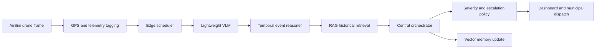

# Architecture

## Design Goal

The system is a centralized AI-powered autonomous aerial environmental
intelligence OS. It uses lightweight Vision-Language Models as the primary
reasoning engine for drone camera feeds. Traditional object detection
frameworks are intentionally avoided.

## Layered System

### Drone Layer

- AirSim autonomous navigation
- continuous aerial monitoring
- GPS tagging and altitude metadata
- frame buffering and snapshot references
- sparse frame capture
- local hazard cues from onboard telemetry

### Edge AI Layer

- lightweight VLM inference
- temporal reasoning across multiple frames
- event candidate generation
- local vector storage
- frame compression
- dynamic resolution scaling
- ROI-focused image crops
- risk estimation

### Central Intelligence Layer

- cross-drone event fusion
- environmental intelligence orchestration
- threat prioritization
- incident verification
- heatmap generation
- AI-generated summaries
- escalation policy
- municipal auto-dispatch hooks

### RAG Intelligence Layer

The RAG layer retrieves:

- previous dumping incidents
- historical sanitation violations
- garbage hotspot history
- prior fire/smoke incidents
- crowd cleanliness patterns
- drain blockage history
- environmental hazard records
- repeated suspicious events
- risk evolution patterns

Retrieved records are inserted into the VLM reasoning prompt and into the
central risk policy. Example contextual conclusion:

```text
This area has experienced repeated illegal dumping during nighttime over the
past three weeks, so the current vehicle-based dumping cue is escalated.
```

### Dashboard Layer

- live drone monitoring
- environmental heatmaps
- incident timelines
- GPS incident mapping
- sanitation hotspot analytics
- severity filtering
- emergency escalation center
- historical playback
- risk scoring
- waste accumulation forecasting placeholder

## Event Reasoning Flow



## VLM-Centric Reasoning

The VLM answers:

- what is happening
- who is involved
- why the activity is suspicious
- whether it is dangerous
- whether similar incidents happened previously
- whether escalation is required
- how severe the situation is

The system expects structured VLM JSON output with event candidates, confidence,
scene description, involved agents, rationale, and temporal evidence. These are
then promoted to normalized environmental events.

## Temporal Intelligence

The temporal reasoner stores recent frame summaries per drone and recent event
candidates per GPS zone. It increases confidence when the same event persists,
adds repeated-zone signals, and can synthesize a repeated sanitation violation
event when a location repeatedly shows dumping, littering, overflowing bins, or
drain blockage.

## Edge Deployment

The 4GB edge runtime should use:

- INT4/INT8 model quantization
- ONNX Runtime or TensorRT execution
- sparse frame reasoning
- event-triggered inference bursts
- low-resolution patrol frames
- high-resolution hazard crops
- local vector cache
- short temporal memory
- async frame capture and inference queues

## Central Deployment

The central node can run heavier verification models, aggregate multiple drones,
store long-term RAG memory, create heatmaps, and execute dispatch policy.

